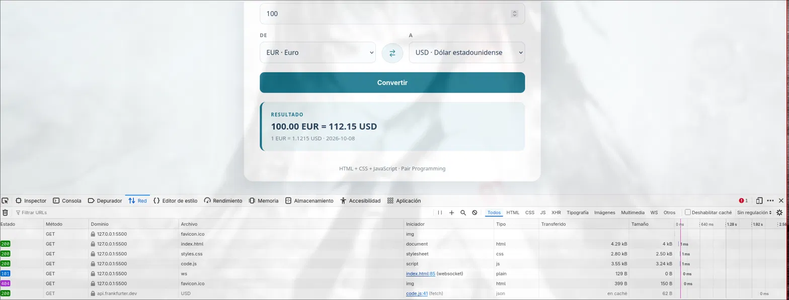
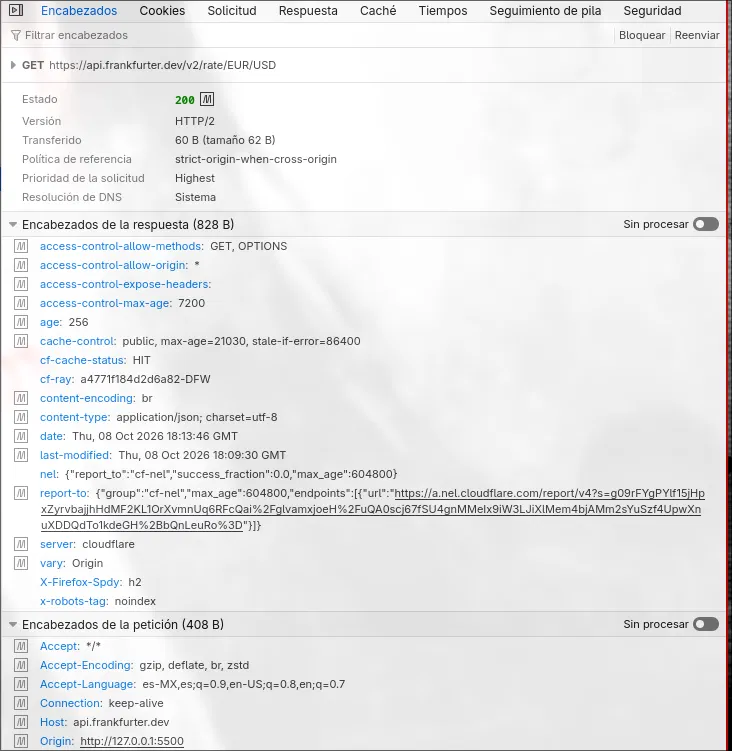
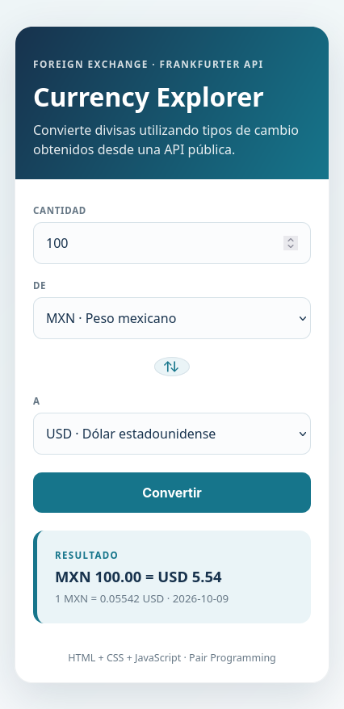
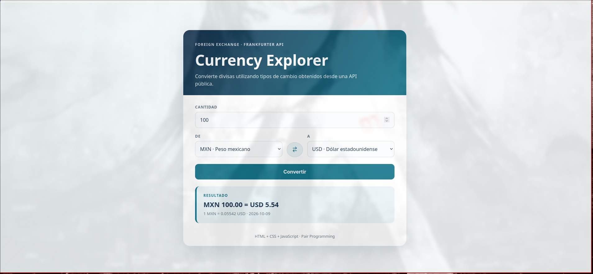

# Currency Explorer

Conversor de divisas en HTML, CSS y JavaScript Vanilla que consume la API pública Frankfurter. Proyecto de Pair Programming.

## Integrantes
- Estudiante A: Sebastián Rodríguez Ruiz
- Estudiante B: Pamela Granados Magueyal

## Objetivo
Completar una aplicación frontend que consuma Frankfurter API para convertir divisas y demostrar comprensión de eventos, DOM, `fetch()`, JSON, asincronía, validación y manejo de errores.

## API utilizada
Frankfurter API v2 (HTTPS, sin API key, respuesta en JSON).

Endpoint de referencia:
`https://api.frankfurter.dev/v2/rate/{origen}/{destino}`

## Ejecución
1. Clona el repositorio.
2. Abre la carpeta en VS Code.
3. Ejecuta `index.html` con Live Server o un servidor local equivalente.
4. Abre DevTools → Console y Network para observar el comportamiento.

## Funcionalidades
- [x] Consulta del tipo de cambio a la API con `fetch()` (Misiones 1-3)
- [x] Selección dinámica de moneda origen y destino (Misión 04)
- [x] Resultado formateado según la moneda (Misión 05)
- [x] Botón para intercambiar monedas (Misión 06)
- [x] Validación completa de la cantidad y las monedas (Misión 07)
- [x] Estado de carga con botones deshabilitados (Misión 08)
- [x] Manejo de errores de red y HTTP (Misión 09)
- [x] Diseño responsive (Misión 10)

## Pair Programming

| Misión | Driver | Navigator | Commit / evidencia |
|---|---|---|---|
| 04 | Pamela | Sebastián | Misión 04: monedas dinámicas desde los selectores — Driver: B / Navigator: A |
| 05 | Sebastián | Pamela | Misión 05: conversión completa con formato por moneda — Driver: A / Navigator: B |
| 06 | Pamela | Sebastián | Misión 06: intercambio de monedas y recálculo — Driver: B / Navigator: A |
| 07 | Sebastián | Pamela | Misión 07: validación de cantidad y monedas — Driver: A / Navigator: B |
| 08 | Pamela | Sebastián | Misión 08: estado de carga y botones deshabilitados — Driver: B / Navigator: A |
| 09 | Sebastián | Pamela | Misión 09: manejo de errores de red y HTTP con response.ok — Driver: A / Navigator: B |
| 10 | Pamela | Sebastián | Misión 10: diseño responsive y estados de interfaz — Driver: B / Navigator: A |

## Diseño por misión
Frase "Necesitamos ___ porque ___" escrita antes de programar cada misión.

- **Misión 04:** Necesitamos leer los valores de los `<select>` porque la URL del endpoint debe depender de la moneda que elija el usuario.
- **Misión 05:** Necesitamos formatear el resultado según la moneda porque no todas usan dos decimales ni resultan legibles con números grandes o muy pequeños.
- **Misión 06:** Necesitamos intercambiar los valores de los dos `<select>` y volver a consultar porque el usuario quiere ver la conversión inversa sin elegir las monedas a mano.
- **Misión 07:** Necesitamos validar la cantidad y las monedas antes de consultar la API porque un valor vacío, cero, negativo o una moneda repetida producen resultados sin sentido o peticiones innecesarias.
- **Misión 08:** Necesitamos mostrar "Consultando..." y deshabilitar los botones mientras se espera la respuesta porque la petición tarda y el usuario podría pensar que no pasó nada o lanzar varias consultas a la vez.
- **Misión 09:** Necesitamos comprobar `response.ok` y distinguir el tipo de fallo porque `fetch()` no lanza error cuando el servidor responde con 404 o 500, y el usuario debe entender qué pasó en lugar de ver un resultado roto.
- **Misión 10:** Necesitamos adaptar el layout a pantallas pequeñas y dar estilo a los estados de la interfaz porque la mayoría de los usuarios consultarán desde el celular y los textos largos de las monedas no caben en tres columnas estrechas.

## Evidencia de red (Checkpoint 1)

Petición `GET https://api.frankfurter.dev/v2/rate/EUR/USD` con estado 200.

**Qué observamos:** el navegador pide el tipo de cambio a la API (Network), recibe un JSON con `date`, `base`, `quote` y `rate`, y `code.js` usa `datos.rate` para calcular y mostrar el resultado (Console y DOM).

## Evidencia de diseño responsive (Misión 10)

**Qué observamos:** en móvil los selectores se apilan en una columna para que el nombre completo de la moneda se lea sin cortarse; en escritorio se mantiene el diseño de tres columnas.

## Checkpoints

| Misión | Checkpoint | Explicado por | Observación |
|---|---|---|---|
| 1 | Console + Network | | |
| 2 | Recorrido clic → DOM | | |
| 04 | `origen` vs `origen.value` | | |
| 05 | Qué viene de la API y qué genera la app | | |
| 06 | Variable `temporal` en el intercambio | | |
| 07 | Validación previa al fetch | | |
| 08 | Uso de `finally` para reactivar los botones | | |
| 09 | Diferencia entre fallo de red (catch) y error HTTP (response.ok) | | |
| 10 | Función del `@media` y por qué va al final del CSS | | |

## Decisiones técnicas

1. Usamos `Intl.NumberFormat` en lugar de `toFixed(2)` porque `toFixed(2)` mostraba 0.01 para 1 JPY → USD y no separaba los miles. Lo encapsulamos en la función `formatearMonto()` para que cada función tenga una sola responsabilidad.
2. Leímos las monedas con `origen.value` y `destino.value`, por lo que no fue necesario modificar la línea de la URL: ya usaba template literals.
3. Para el caso EUR → EUR elegimos la Opción A: bloquear la acción y notificar al usuario con un mensaje claro, priorizando la simplicidad del código y evitando llamadas innecesarias a la API.
4. Usamos un bloque `finally` para reactivar los botones porque se ejecuta siempre, tanto si la consulta tiene éxito como si falla; sin él, un error dejaría la interfaz bloqueada.
5. Comprobamos `response.ok` antes de llamar a `response.json()` para capturar respuestas con código de error HTTP (como 404 o 500), lanzando un error intencional para que el bloque `catch` lo procese. Además, centralizamos los mensajes en `obtenerMensajeError()` para separar la lógica de red de la presentación al usuario.
6. En pantallas pequeñas apilamos los selectores en una sola columna en lugar de reducir el tamaño del texto, porque con tres columnas cada selector quedaba de unos 125 px y el nombre de la moneda se cortaba. Agregamos el `@media` al final de `styles.css` para que sus reglas tengan prioridad.

## Pendientes detectados
- Ninguno por ahora.

## Resueltos
- EUR → EUR (misma moneda en origen y destino): resuelto en la Misión 07 con un mensaje de validación.
- Error HTTP no detectado (resultado `NaN`): resuelto en la Misión 09 comprobando `response.ok`.
- Selectores cortados en móvil: resuelto en la Misión 10 con un diseño en una columna.

## Revisión cruzada
- **Aspecto bien resuelto:** La separación de la lógica de mensajes de error en `obtenerMensajeError()`, permitiendo respuestas claras según si falló la red o la API.
- **Error o comportamiento mejorable:** Antes de la Misión 09, al simular un error HTTP (como una URL incorrecta con `/v2/ratee/`), la aplicación no entraba al `catch` y mostraba un resultado `NaN` en pantalla al intentar procesar una respuesta de error como si fuera un JSON válido.
- **Propuesta de mejora:** Lanzar un error manualmente cuando `response.ok` sea `false` antes de intentar analizar el cuerpo de la respuesta con `.json()`.
- **Cambio incorporado después de la revisión:** Se agregó la validación `if (!respuesta.ok) throw error` y la traducción adecuada de estados HTTP (404, 500, etc.) hacia mensajes amables para el usuario.

## Reflexión final (150–200 palabras)
El principal aprendizaje técnico fue comprender el recorrido completo de los datos: un clic dispara un evento, fetch() solicita el JSON a la API, response.json() lo convierte en un objeto y JavaScript calcula y actualiza el DOM con textContent. Entendimos que HTTP y JSON son pasos distintos: fetch() solo lanza error ante fallos de red, por lo que un 404 no entraba al catch y mostraba NaN hasta que comprobamos response.ok antes de leer el JSON.

La dificultad más relevante fue el ámbito de las variables y el orden de ejecución. Al principio intentamos usar datos y respuesta fuera del bloque donde se declaraban, y obtuvimos errores de referencia que nos obligaron a entender dónde existe cada variable y por qué la asincronía exige esperar con await antes de usar la respuesta.

Una decisión surgida del trabajo Driver/Navigator fue el caso EUR → EUR. Mientras uno escribía el código de los selectores, el otro propuso probar pares repetidos y detectó que la consulta no tenía sentido. Lo anotamos como pendiente y en la Misión 07 elegimos bloquear la acción con un mensaje claro, evitando peticiones innecesarias. Comprobamos que el Navigator no solo observa: anticipa errores.